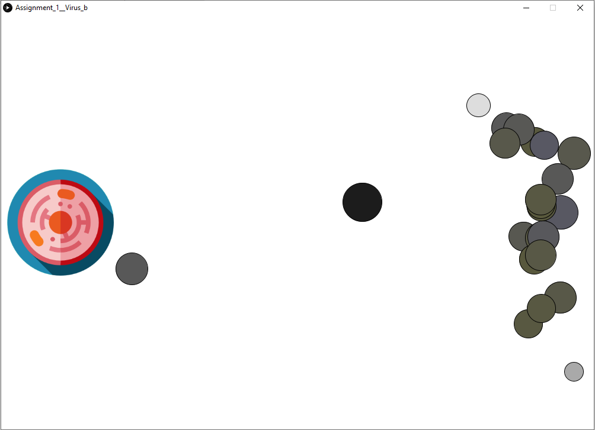

## What I Changed
For this iteration of the project, I changed some of the functionality which now makes use of the DNA class, and the rest of the code works perfectly. Initially, due to a misunderstanding, I attempted to create something 
that I did not have the skill level for. Therefore, for this iteration instead of making the viruses learn how to reach the target (the cell), I made them behave more like real life viruse.

In real life viruses do not learn how to reach a cell. They reach it by chance. However, as they reach it they infect the cell and a large number of new viruses is born. I attempted to simulate this and
made the virus replicate by touching the cell (or being in its proximity). As soon as that happens, the program takes the DNA of the virus that touched the cell and creates many new viruses from that DNA, only with
slightly mutated characteristics. The DNA gives color and size of the viruses.

## Example

In this image we can see how there are random viruses on screen, however the ones that are being created (on the right side of the screen) are very similar to the one that is closest to the cell.

## Future Goals
Although I modified the program to be closer to what our initial assignment was, I still hope to work on it more and implement my initial idea after we learn about memory in code.
I am hopeful that the upcoming class material will allow me to go furhter with developing this code.
