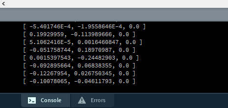
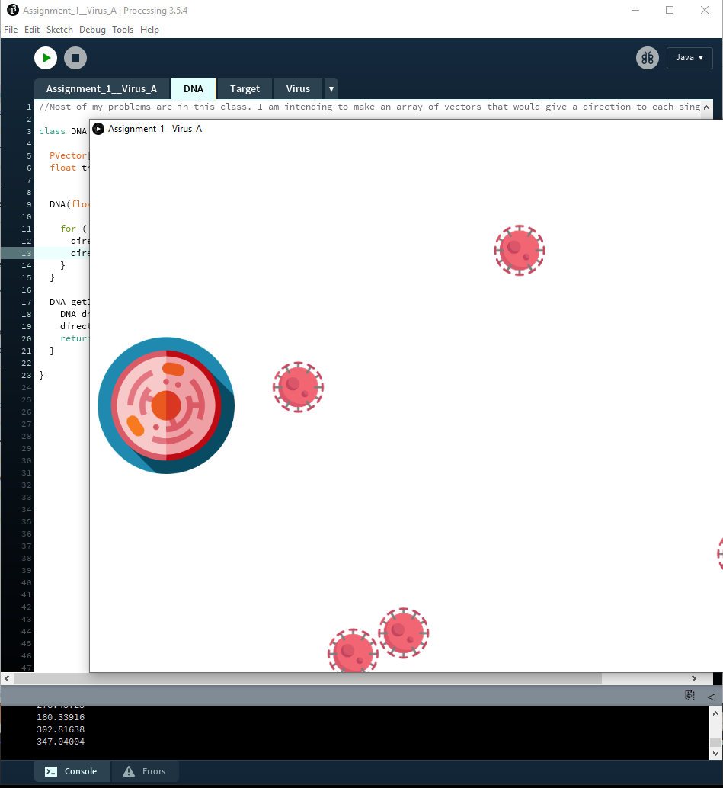

## Introduction:

For this assignment I wanted to create a simulation of viruses evolving to attack a cell. The idea is that the program begins with some predefined number of viruses and randomly discovers a cell, which every generation attempts to attack more. If the virus particle leaves the screen borders, it dies.

## Difficulties:

I presonally found this to be one of the most challenging attempts in coding. I came across many errors such as null pointer exceptions, syntax problems, global and local variable issues, etc. It was especially difficult dealing with vector arrays in the DNA class. I have been working on the code every day since Thursday (4 and a half days) and I managed to solve many of the issues. The learning process was long and complicated, but I definately learned a lot from this coding excercise. For example, I am quite happy with how killing the virus cells code turned out. However, I did not manage to get the DNA class fully working, and I am very confused for why many of my attempts did not succeed, but I am extremely determined to make it work properly, and learn even more from the experience.

## Techniques:
The println() tool was extremely useful for trying to debug many parts of my code, and even though some features do not show visually, I made sure they were working properly using this tool as the professor suggested. For example, to see if appropriate values are being returned, if the counters are working properly, and check if my fitness function was doing what it was supposed to be doing. Thanks to this, I narrowed down and solved most of my issues.

## Examples:

