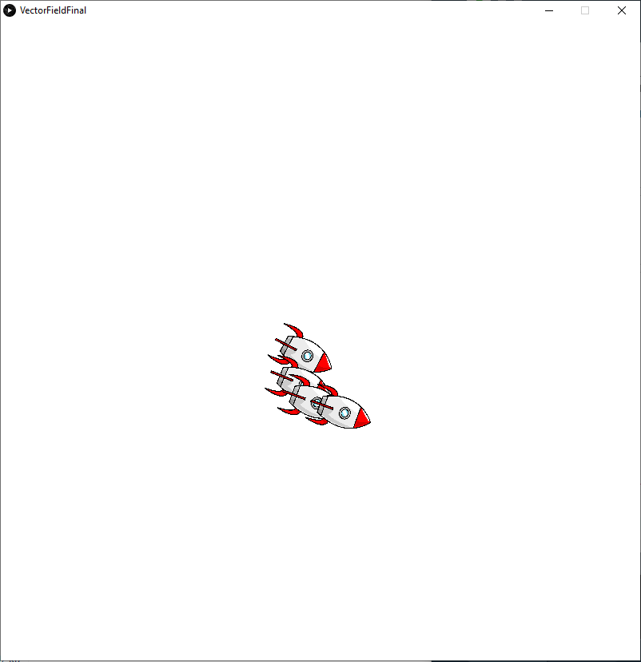

## Assignment 2
For this assignment I created a vector flow field which always points towards the mouse pointer. The vehicles which can be added will always follow the flow field and move towards the mouse pointer.

## Difficulties
I was struggling to make the flow field follow the mouse pointer, but after reviewing the lectures, watching tutorials, and exploring code examples, I successfuly completed the task.
This helped me understand flow fields better

## Image

