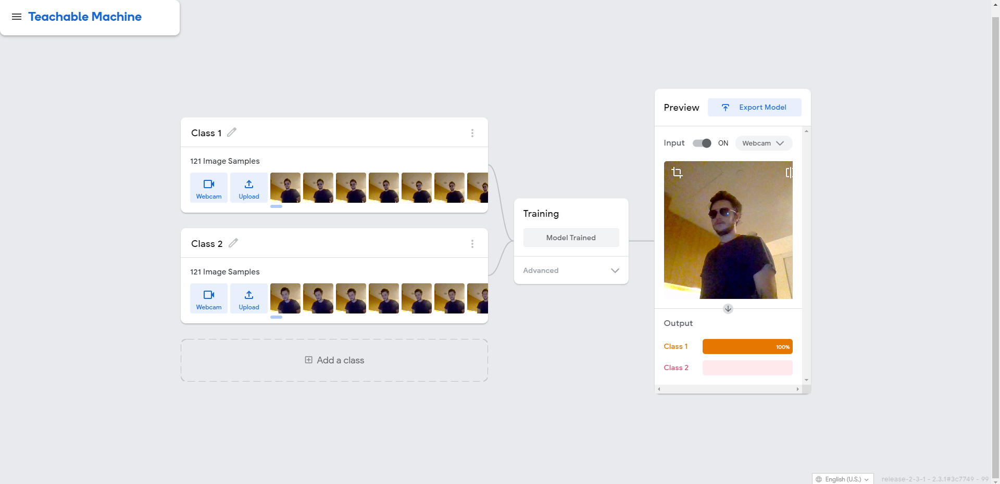
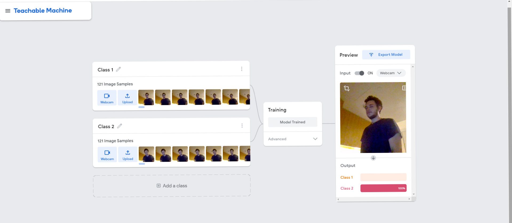
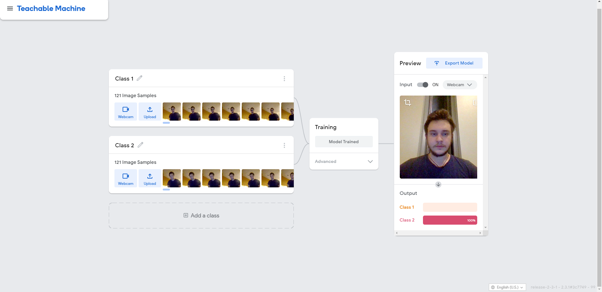
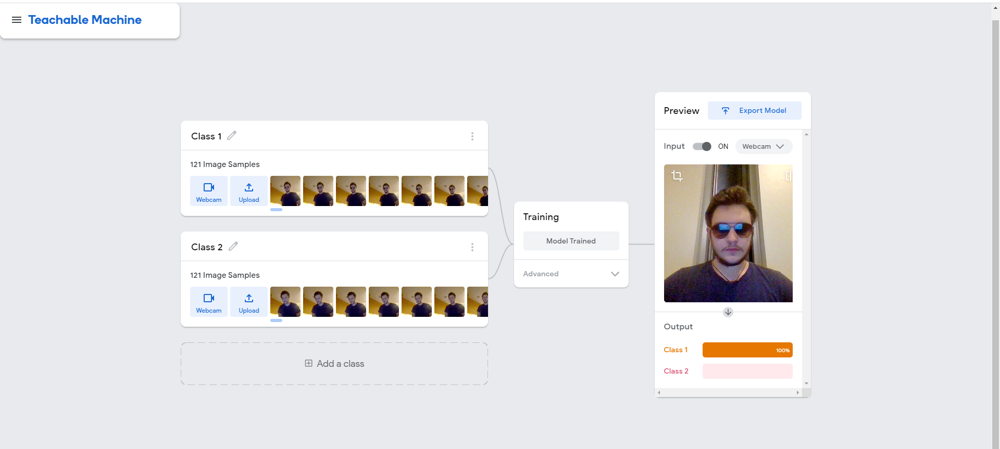
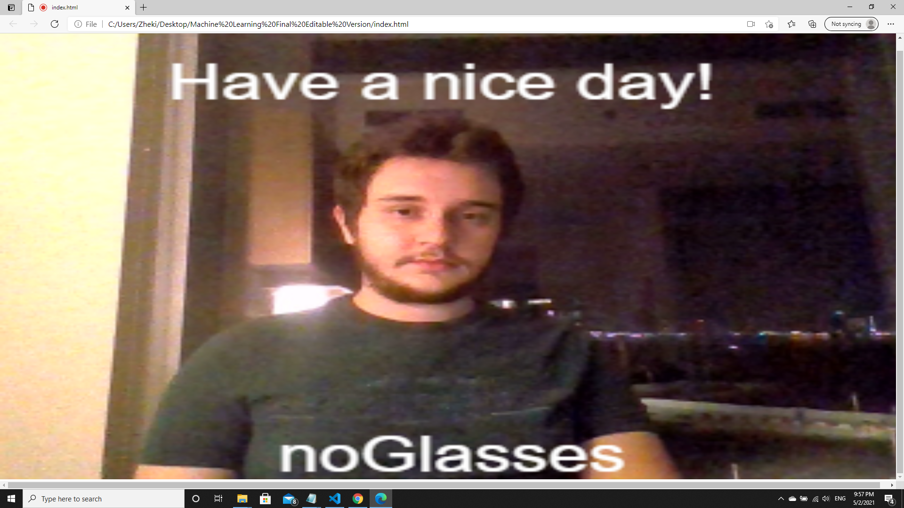
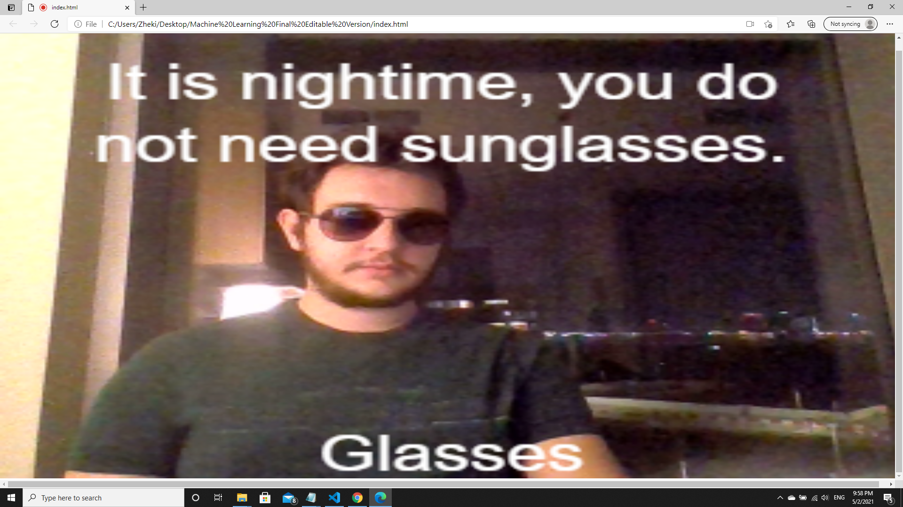

# Project Documentation

I had an idea to make my project revolve around the concept of machine learning. I was inspired to do this by all the discussions and excercises we had during the semester. We discussed AI, and the idea of inteligent machines, and because of that I decided that I would like to explore machine learning. I proposed this type of project and got approval from the professor.

As I started the project, I was slightly lost, but this was completely okay, because I knew that this would be an amazing learning experience. Thanks to the professor, I got on track and began studying the ML concepts from online resources such as Dan Schiffman's videos and the documentation of ML5.js and Tensorflow.

The first technology that I explored is image recognition by pre-trained models such as Coco-SSD, but I realized that, although I was encouraged to attempt something simple, this could have been too simple for a ML project.

I became interested in training my own models. Because of this I started to think of ways in which I could train my own model, and there were some educational materials on this, however, they were either too simple, or too complex for me to understand in the span of a week.

As I previously mentioned, in class we discussed the relationship between humans and robots, and instances in which robots make the life of humans easier. This was my inspiration for the creative concept of my project. I wanted to solve a problem which I frequently encounter. One of the biggest problems of living in a country where it is constantly sunny is that I very often forget to take or wear my sunglasses when I am outdoors.

After doing some research, I discovered an amazing tool by Google, called Teachable Machine (https://teachablemachine.withgoogle.com/). This tool is used to train your own machine learning models, and is quite simple to work with. However, I made it my mission to understand better how the tool works, so that I could train my model in the most ideal way possible. I spent a couple days doing this, and when I felt satisfied by the power of my model, I began coding.

So I made a tool, powered my machine learning, that would recognize if I am wearing sunglasses or not before I leave my home. Then by checking whether it is daytime or nighttime, and if I am wearing sunglasses or not, the machine would advise me on what to do.

